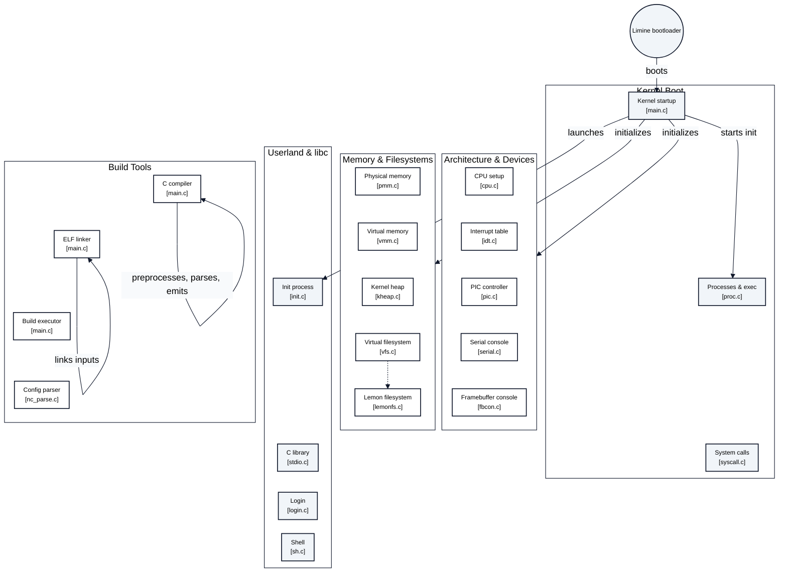

```mermaid
%%{init: {'theme': 'base', 'themeVariables': {'primaryColor': '#ffffff', 'primaryTextColor': '#000000', 'primaryBorderColor': '#0f172a', 'lineColor': '#0f172a', 'secondaryColor': '#f8fafc', 'tertiaryColor': '#ffffff', 'clusterBkg': '#ffffff', 'clusterBorder': '#0f172a'}, 'flowchart': {'nodeSpacing': 12, 'rankSpacing': 25, 'padding': 8}}}%%
flowchart TD

node_limine(("Limine bootloader"))

subgraph group_boot["Kernel Boot"]
  direction TB
  node_kmain["Kernel startup<br/>[main.c]"]
  node_proc["Processes &amp; exec<br/>[proc.c]"]
  node_syscall["System calls<br/>[syscall.c]"]
  node_kmain ~~~ node_proc ~~~ node_syscall
end

subgraph group_hardware["Architecture &amp; Devices"]
  direction TB
  node_cpu["CPU setup<br/>[cpu.c]"]
  node_idt["Interrupt table<br/>[idt.c]"]
  node_pic["PIC controller<br/>[pic.c]"]
  node_serial["Serial console<br/>[serial.c]"]
  node_fbcon["Framebuffer console<br/>[fbcon.c]"]
  node_cpu ~~~ node_idt ~~~ node_pic ~~~ node_serial ~~~ node_fbcon
end

subgraph group_storage["Memory &amp; Filesystems"]
  direction TB
  node_pmm["Physical memory<br/>[pmm.c]"]
  node_vmm["Virtual memory<br/>[vmm.c]"]
  node_kheap["Kernel heap<br/>[kheap.c]"]
  node_vfs["Virtual filesystem<br/>[vfs.c]"]
  node_lemonfs["Lemon filesystem<br/>[lemonfs.c]"]
  node_pmm ~~~ node_vmm ~~~ node_kheap ~~~ node_vfs -.-> node_lemonfs
end

subgraph group_userland["Userland &amp; libc"]
  direction TB
  node_init["Init process<br/>[init.c]"]
  node_libc["C library<br/>[stdio.c]"]
  node_login["Login<br/>[login.c]"]
  node_shell["Shell<br/>[sh.c]"]
  node_init ~~~ node_libc ~~~ node_login ~~~ node_shell
end

subgraph group_toolchain["Build Tools"]
  direction TB
  node_nircc["C compiler<br/>[main.c]"]
  node_nirld["ELF linker<br/>[main.c]"]
  node_nirmake["Build executor<br/>[main.c]"]
  node_nirconfig["Config parser<br/>[nc_parse.c]"]
  node_nircc ~~~ node_nirld ~~~ node_nirmake ~~~ node_nirconfig
end

node_limine -->|"boots"| node_kmain
node_kmain -->|"initializes"| group_hardware
node_kmain -->|"initializes"| group_storage
node_kmain -->|"starts init"| node_proc
node_kmain -->|"launches"| node_init
node_nircc -->|"preprocesses, parses, emits"| node_nircc
node_nirld -->|"links inputs"| node_nirld

group_boot ~~~ group_toolchain

click node_kmain "https://github.com"
click node_init "https://github.com"
click node_cpu "https://github.com"
click node_idt "https://github.com"
click node_pic "https://github.com"
click node_serial "https://github.com"
click node_fbcon "https://github.com"
click node_pmm "https://github.com"
click node_vmm "https://github.com"
click node_kheap "https://github.com"
click node_vfs "https://github.com"
click node_lemonfs "https://github.com"
click node_proc "https://github.com"
click node_syscall "https://github.com"
click node_libc "https://github.com"
click node_login "https://github.com"
click node_shell "https://github.com"
click node_nircc "https://github.com"
click node_nirld "https://github.com"
click node_nirmake "https://github.com"
click node_nirconfig "https://github.com"

classDef boxWhite fill:#ffffff,stroke:#0f172a,stroke-width:1.5px,color:#000000,font-size:11px
classDef boxLightGrey fill:#f1f5f9,stroke:#0f172a,stroke-width:1.5px,color:#000000,font-size:11px

class node_limine,node_kmain,node_proc,node_syscall boxLightGrey
class node_cpu,node_idt,node_pic,node_serial,node_fbcon boxWhite
class node_pmm,node_vmm,node_kheap,node_vfs,node_lemonfs boxWhite
class node_init,node_libc,node_login,node_shell boxLightGrey
class node_nircc,node_nirld,node_nirmake,node_nirconfig boxWhite
```

